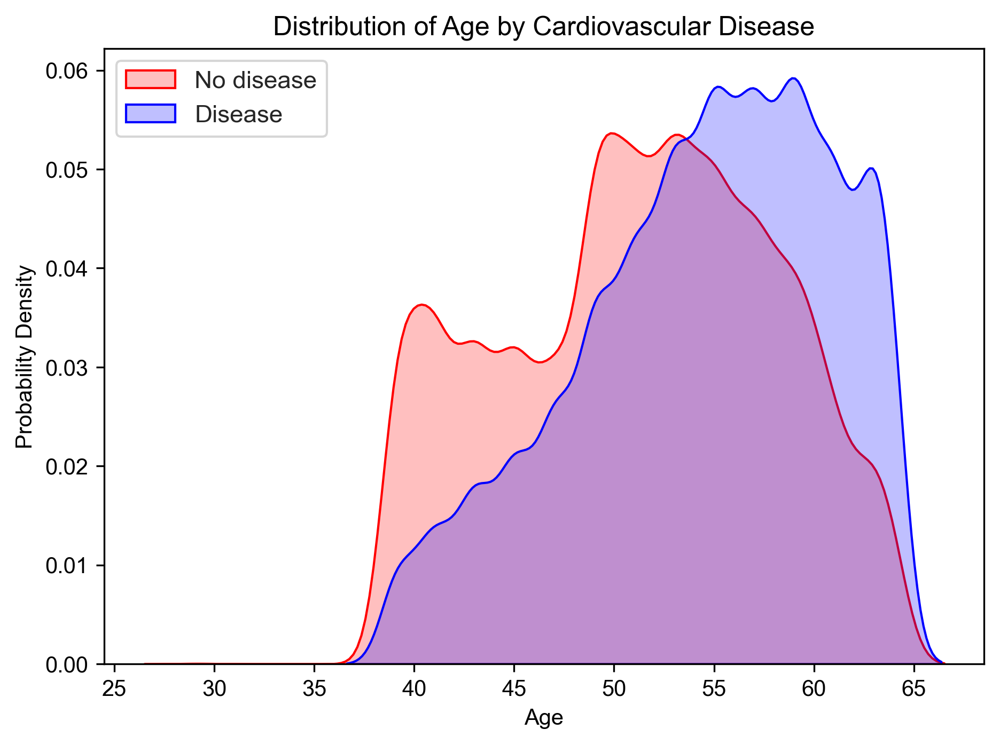
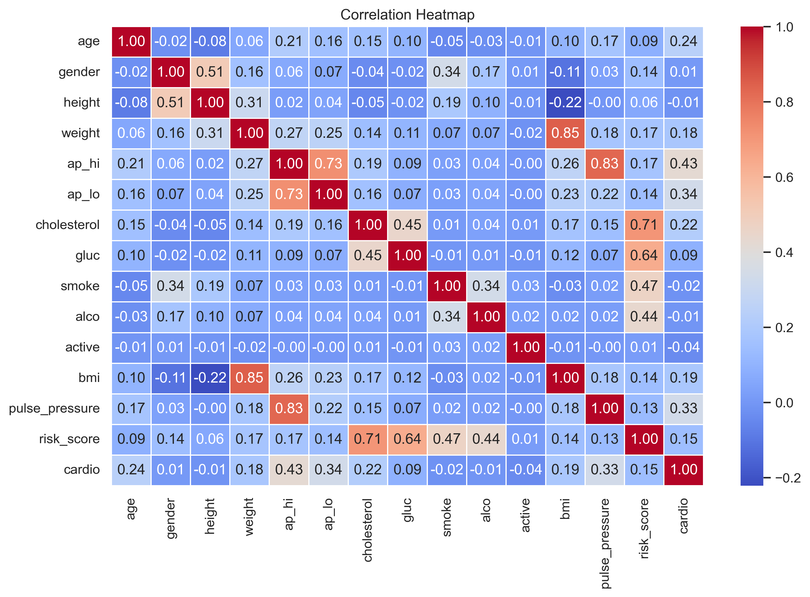
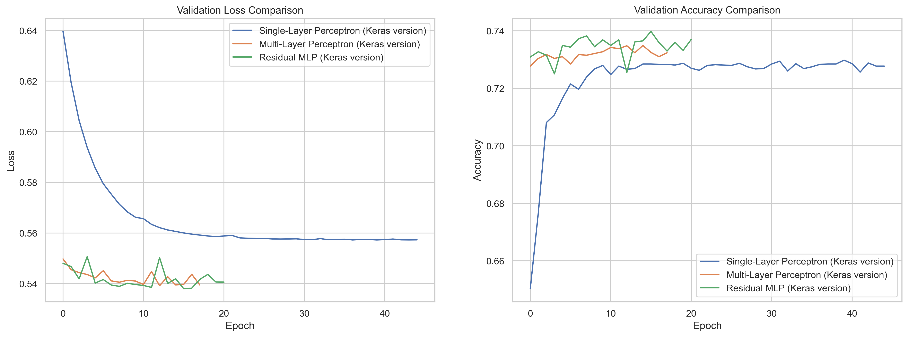

# Cardiovascular Disease Prediction

## Project Overview

This project focuses on predicting cardiovascular disease using Deep Learning models built with TensorFlow/Keras. The workflow includes data cleaning, feature engineering, exploratory data analysis (EDA), model training, and performance evaluation. Multiple neural network architectures were compared, including a Single-Layer Perceptron, Multi-Layer Perceptron (MLP), and Residual MLP. The Residual MLP achieved the best overall performance with an AUC score above 0.80.

## Objectives

- Predict cardiovascular disease using Deep Learning
- Compare neural network architectures
- Evaluate model performance

## Technologies Used

- Python
- TensorFlow / Keras
- Pandas
- NumPy
- Scikit-learn
- Matplotlib
- Seaborn

## Dataset

Dataset used in this project:
Cardiovascular Disease Dataset

Source:
https://www.kaggle.com/datasets/sulianova/cardiovascular-disease-dataset

The dataset contains anonymized medical examination records and lifestyle-related features used for cardiovascular disease prediction.

## Workflow

1. Dataset Description
2. Data Loading and Initial Inspection
3. Data Cleaning and Preparation
4. Exploratory Data Analysis (EDA)
5. Data Preprocessing
6. Model Development
7. Model Evaluation and Comparison
8. Final Model Selection

## Models Used

- Single-Layer Perceptron
- Multi-Layer Perceptron (MLP)
- Residual MLP

## Results

Residual MLP achieved the best overall performance:

- Accuracy: ~73.85%
- AUC: ~0.80

## Visualizations

## EDA visualization

## Correlation Heatmap

## Model comparison

